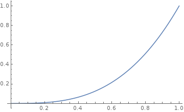
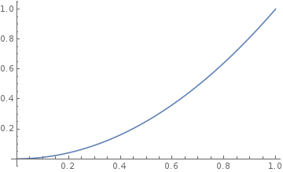

# rxan-core #

[](https://www.npmjs.com/package/rxan-core)
[](https://www.npmjs.com/package/rxan-core)
[](https://github.com/Ailrun/rxan-core/blob/stable/LICENSE)
[](https://github.com/Ailrun/rxan-core/tags)
[](https://github.com/Ailrun/rxan-core)

Core package for rxan

## FOR RXJS@^5 SUPPORTS
This is **alpha** version of rxan-core supporting `rxjs@^6`.

To see stable version that supports `rxjs@^5`, please check [stable branch].

[stable branch]: https://github.com/Ailrun/rxan-core/tree/stable

<!-- markdown-toc start - Don't edit this section. Run M-x markdown-toc-refresh-toc -->
## Table of Contents ##

- [rxan-core](#rxan-core)
    - [Requirement](#requirement)
    - [How to install](#how-to-install)
    - [How to use](#how-to-use)
    - [APIs](#apis)
        - [msElapsed](#mselapsed)
        - [during](#during)
        - [periodOf](#periodof)
        - [toggle](#toggle)
        - [easing](#easing)
            - [easing.back](#easingback)
            - [easing.bounce](#easingbounce)
            - [easing.circle](#easingcircle)
            - [easing.cubic](#easingcubic)
            - [easing.elastic](#easingelastic)
            - [easing.exponential](#easingexponential)
            - [easing.linear](#easinglinear)
            - [easing.quadratic](#easingquadratic)
            - [easing.sine](#easingsine)
    - [Author](#author)

<!-- markdown-toc end -->

## Requirement ##

This package requires `rxjs@^6` as peer dependency.
You should install [RxJS](http://reactivex.io/rxjs/) in your project to use this package.

## How to install ##

```shell
npm install rxan-core@alpha
# To install RxJS too,
npm install rxjs@alpha
```

## How to use ##

with jQuery

```javascript
const $ = require('jQuery')
const rxanC = require('rxan-core')
const map = require('rxjs/operators').map

const target = $('#target')

// Make animation for 500 ms. It generates value from 0 to 1.
rxanC.during()(500).pipe(
  map(function (percent) {
    return percent * 100                // mapping 0~1 to 0~100
  })
)
  .subscribe(function (marginTop) {
    target.css('marginTop', marginTop)  // assign 0~100 to marginTop of target
  })
```

with React (you can also use [rxan-react](https://github.com/Ailrun/rxan-react/))

```javascript
import React, { Component } from 'react'
import { during, easing } from 'rxan-core'

class Example extends Component {
  constructor(props) {
    super(props)

    this.state = {
      // Initial value for marginTop
      marginTop: 0
    }

    this.subscription = during()(500).pipe(
      map((percent) => percent * 100) // mapping 0~1 to 0~100
    )
      .subscribe((marginTop) => {
        this.setState({
          marginTop: marginTop         // assign 0~100 to state.marginTop
        })
      })
  }

  componentWillUnmount() {
    this.subscription.unsubscribe()
  }

  render() {
    return (
      <div style={{ marginTop: this.state.marginTop }}>
        Example!
      </div>
    )
  }
}
```

## APIs ##

### msElapsed ###
- Usage
  ```javascript
  msElapsed(scheduler)
  ```
- Description
  Function that makes an observable of elapsed times.
  This emits values everytime its scheduler schedules.
  For example, without any scheduler (i.e., with default `animationFrame` scheduler), this emits a value per animation frame.
- Parameters
    - `scheduler`
      [Rx.js Scheduler] or `undefined`.
      For `undefined` case, default scheduler is `animationFrame` scheduler.
- *Warnings*
    - *Do not use `queue` scheduler as scheduler. Such uses make an inifinite loop.*
    - *You should unsubscribe this, since this function makes an infinite length observable. If you do not unsubscribe this, it will not garbage collected.*

### during ###
- Usage
  ```javascript
  during(scheduler)(duration)
  ```
- Description
  Function that makes an observable of values from `0` to `1`. Emitted values are percent of time per duration, i.e., this initially emits `0`, and finally emits `1` after specified `duration`.
  This emit values only when its scheduler schedules.
- Parameters
    - `scheduler`
      [Rx.js Scheduler] or `undefined`.
      For `undefined` case, default scheduler is `animationFrame` scheduler.
    - `duration`
      Positive `Number`.
      Duration for animation.
- *Warning*
    - *Do not use `queue` scheduler as scheduler. Such uses make an inifinite loop.*

### periodOf ###
- Usage
  ```javascript
  periodOf(scheduler)(period, cycles)
  ```
- Description
  Function that makes an observable emits value once per period.
  This emits the current cycle of this period, start from `1`.
  **This does not emit `1` immediately. This emit it after first period passed.**
  This emit values only when its scheduler schedules.
- Parameters
    - `scheduler`
      [Rx.js Scheduler] or `undefined`.
      For `undefined` case, default scheduler is `animationFrame` scheduler.
    - `period`
      Positive `Number`.
      Period of animation.
    - `cycles`
      Positive `Number` or `undefined`.
      Cycles of animation. This function emit values `cycles` times and final value is `cycles`.
      For `undefined` case, default value is `Number.POSITIVE_INFINITY`.
- *Warning*
    - *You should unsubscribe this when third argument is `undefined` or `Number.POSITIVE_INFINITY`, since such calls for this function make an infinite length observable. If you do not unsubscribe this, it will not garbage collected.*

### toggle ###
- Usage
  ```javascript
  toggle(scheduler)(period, cycles)
  ```
- Description
  Function that makes an observable emits boolean once per period.
  First boolean is `true`, and next is `false`, and next is true, ... and so on.
  **This does not emit `true` immediately. This emit it after first period passed.**
  This emit values only when its scheduler schedules.
- Parameters
    - `scheduler`
      [Rx.js Scheduler] or `undefined`.
      For `undefined` case, default scheduler is `animationFrame` scheduler.
    - `period`
      Positive `Number`.
      Period of animation.
    - `cycles`
      Positive `Number` or `undefined`.
      Cycles of animation. This function emit values `cycles` times and final value is `cycles % 2 === 1`.
      For `undefined` case, default value is `Number.POSITIVE_INFINITY`.
- *Warning*
    - *You should unsubscribe this when third argument is `undefined` or `Number.POSITIVE_INFINITY`, since such calls for this function make an infinite length observable. If you do not unsubscribe this, it will not garbage collected.*

### easing ###
Easing functions are for mapping values between `0`~`1` to curve-shaped values starts from 0 and ends at 0.
Every easing functions have its `in`, `out`, `inout` variants. You can use those like `easing.back.out`. Default function itself is `in` version. (i.e., `easing.back === easing.back.in`)

#### easing.back ####

| In version | Out version | InOut version |
|------------|-------------|---------------|
||||

#### easing.bounce ####

| In version | Out version | InOut version |
|------------|-------------|---------------|
||||

#### easing.circle ####

| In version | Out version | InOut version |
|------------|-------------|---------------|
||||

#### easing.cubic ####

| In version | Out version | InOut version |
|------------|-------------|---------------|
||||

#### easing.elastic ####

| In version | Out version | InOut version |
|------------|-------------|---------------|
||||

#### easing.exponential ####

| In version | Out version | InOut version |
|------------|-------------|---------------|
||||

#### easing.linear ####

| In version | Out version | InOut version |
|------------|-------------|---------------|
||||

#### easing.quadratic ####

| In version | Out version | InOut version |
|------------|-------------|---------------|
||||

#### easing.sine ####

| In version | Out version | InOut version |
|------------|-------------|---------------|
||||

## Author ##

- Junyoung Clare Jang: @ailrun

[Rx.js Scheduler]: http://reactivex.io/rxjs/manual/overview.html#scheduler
